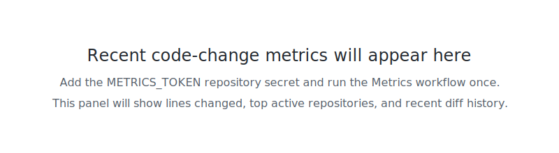
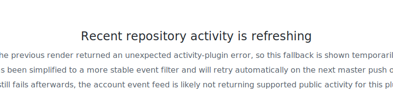

<h1 align="center">Hi, There is Toph Lumina</h1>
<h3 align="center">A curious university student who interested in Computer Graphics and Game Engine Tech.</h3>

  

<h3 align="center">GitHub Snapshot:</h3>

	
	

	

	

	

<h3 align="center">Languages and Tools:</h3>

       

